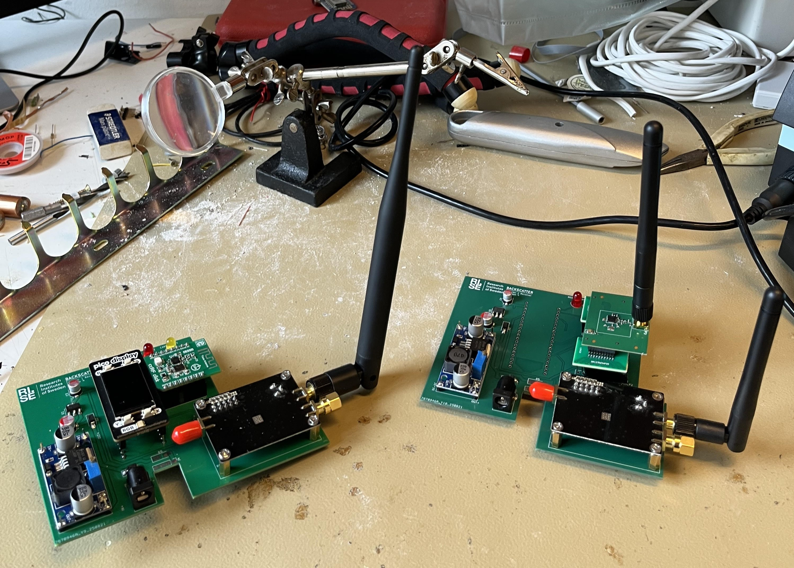

# Humanscatter v4 — Low-Power Backscatter Wireless Communication Prototype  
**Summer Research Project at RISE Research Institutes of Sweden**  

<p align="center">
  
</p>

Humanscatter v4 is an **enhanced version** of the [original Humanscatter project](https://github.com/amau75/Humanscatter), developed as part of a **summer research internship** at **RISE Research Institutes of Sweden**.  
This work focuses on **improving the range, reliability, and power stability** of a **low-power backscatter wireless communication prototype** for battery-free IoT applications.

---

## What's New in Humanscatter v4

### **v4.1**
- **Carrier module upgraded** to an **ADF4351 RF synthesizer** instead of CC2500.
- Added **AMS1117 3.3 V LDO regulator** for **cleaner and more stable power**.
- Improved range thanks to **better carrier control** and lower noise.
- Redesigned **KiCad PCB design** and updated **Raspberry Pi Pico firmware**.

### **v4.2**
- Built on top of v4.1 enhancements.
- **Receiver module upgraded** to a **CC2500 EMK evaluation kit**.
- Switched from a **trace antenna** to an **SMA-based external antenna** for better sensitivity.
- **AMS1117 regulator retained** for stable RF power delivery.
- Further improved range, carrier stability, and signal reliability.

---

## Hardware Overview

| Component            | Original                    | v4.1                               | v4.2                                 |
|----------------------|-----------------------------|-------------------------------------|--------------------------------------|
| **Carrier Module**   | CC2500                      | **ADF4351** (RF synthesizer)        | **ADF4351** (RF synthesizer)        |
| **Receiver Module**  | CC2500 (trace antenna)      | CC2500 (trace antenna)             | **CC2500 EMK** + **SMA antenna**    |
| **Voltage Regulator**| None                        | **AMS1117 (3.3 V LDO)**            | **AMS1117 (3.3 V LDO)**            |
| **Microcontroller**  | Raspberry Pi Pico          | Raspberry Pi Pico                  | Raspberry Pi Pico                  |
| **Antenna Type**     | Trace PCB antenna          | Trace PCB antenna                  | **SMA external antenna**           |
| **PCB Design**       | Original Humanscatter PCB  | Updated KiCad design               | Updated KiCad design               |

---

## Repository Structure

```

humanscatter-v4/
│
├── humanscatter-v4.1/
│   ├── kicad/           # KiCad schematic + PCB files for v4.1
│   └── firmware/        # Updated Raspberry Pi Pico code for v4.1
│
├── humanscatter-v4.2/
│   ├── kicad/           # KiCad schematic + PCB files for v4.2
│   └── firmware/        # Updated Raspberry Pi Pico code for v4.2
│
└── README.md            # This file

````

---

## Getting Started

### 1. Clone the Repository
```bash
git clone https://github.com/yourusername/humanscatter-v4.git
cd humanscatter-v4
````

### 2. Open KiCad Project

```bash
cd humanscatter-v4.1/kicad
open humanscatter-v4.1.kicad_pro
```

*(Same for `humanscatter-v4.2`.)*

### 3. Build and Flash Firmware

* Follow the same steps as in the [original Humanscatter project](https://github.com/amau75/Humanscatter).
* Replace the firmware files with the updated ones provided in the **`firmware/`** folder.
* Flash the code to the **Raspberry Pi Pico** using **Thonny** or any other MicroPython flashing tool.

##  Experimental Improvements

The key goals of this research were to **improve range**, **stability**, and **power delivery**.
Using the **ADF4351 RF synthesizer**, **AMS1117 regulator**, and an **SMA-based CC2500 EMK receiver**:

* Achieved **greater link distance** compared to original version.
* Improved **signal-to-noise ratio (SNR)**.
* Reduced **carrier frequency drift**.
* Increased **overall communication reliability**.

---

## License

This project builds upon the original [Humanscatter](https://github.com/amau75/Humanscatter)
and is released under the **CERN-OHL-P** open hardware license.

---

## Acknowledgements

* **Dr. Fehmi Ben Abdesslem** — for supervision and continuous support throughout the summer research
* **Amaury Couderc** — for the original Humanscatter project and guidance
* **RISE Research Institutes of Sweden** — for hosting and supporting the project

---

## 🔗 References

* Original Humanscatter repository: [https://github.com/amau75/Humanscatter](https://github.com/amau75/Humanscatter)
* ADF4351 RF Synthesizer Module: [Datasheet](https://www.analog.com/media/en/technical-documentation/data-sheets/ADF4351.pdf)
* CC2500 RF Transceiver: [Datasheet](https://www.ti.com/product/CC2500)
* AMS1117 Voltage Regulator: [Datasheet](http://www.advanced-monolithic.com/pdf/ds1117.pdf)

```